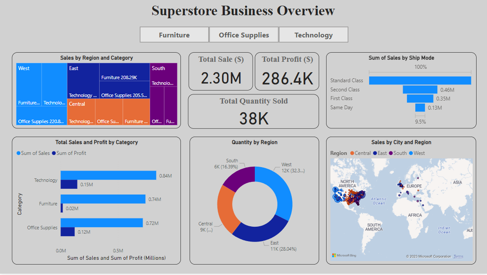
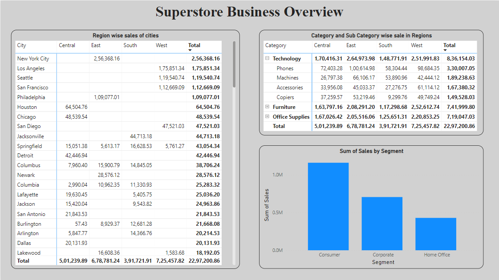

# PowerBI Dashboard - Sales Analysis

## Overview

This repository contains a PowerBI dashboard analyzing sales data. The dataset provides insights into various aspects such as sales performance, profitability, customer segments, and regional trends. The dashboard was created to facilitate a clear understanding of key metrics and to guide decision-making processes.

## Dashboard Preview

## Key Insights

### Sales Overview

- **Total Sales:** $2.30 Million
- **Total Profit:** $286,400

### Customer Segments

- The 'Consumer Segment' dominates with the highest number of sales.

### Regional Highlights

- **Los Angeles Leads in Sales:** $175,851
- **Top Sales Regions:**
  - Central Region (Houston): $64,504
  - West Region (Los Angeles): $175,851
  - East Region (New York): $256,368
  - South Region (Jacksonville): $44,713

### Category and Product Insights

- **Top Category:** Technology
  - **Best-Selling Product:** Phone ($330,007 in total sales)

### Shipping Preferences

- 'Standard Class' is the most preferred shipping mode.

## How to Access the Dashboard

1. Download and install [Power BI Desktop](https://powerbi.microsoft.com/desktop/).
2. Clone or download this repository.
3. Open the PowerBI file (Superstore_Dashboard.pbix) using Power BI Desktop.
4. Explore the dashboard interactively.

## Contributing

If you'd like to contribute or have suggestions, feel free to open an issue or submit a pull request.

Happy Analyzing! 🚀

# SuperStore_Dashboard

